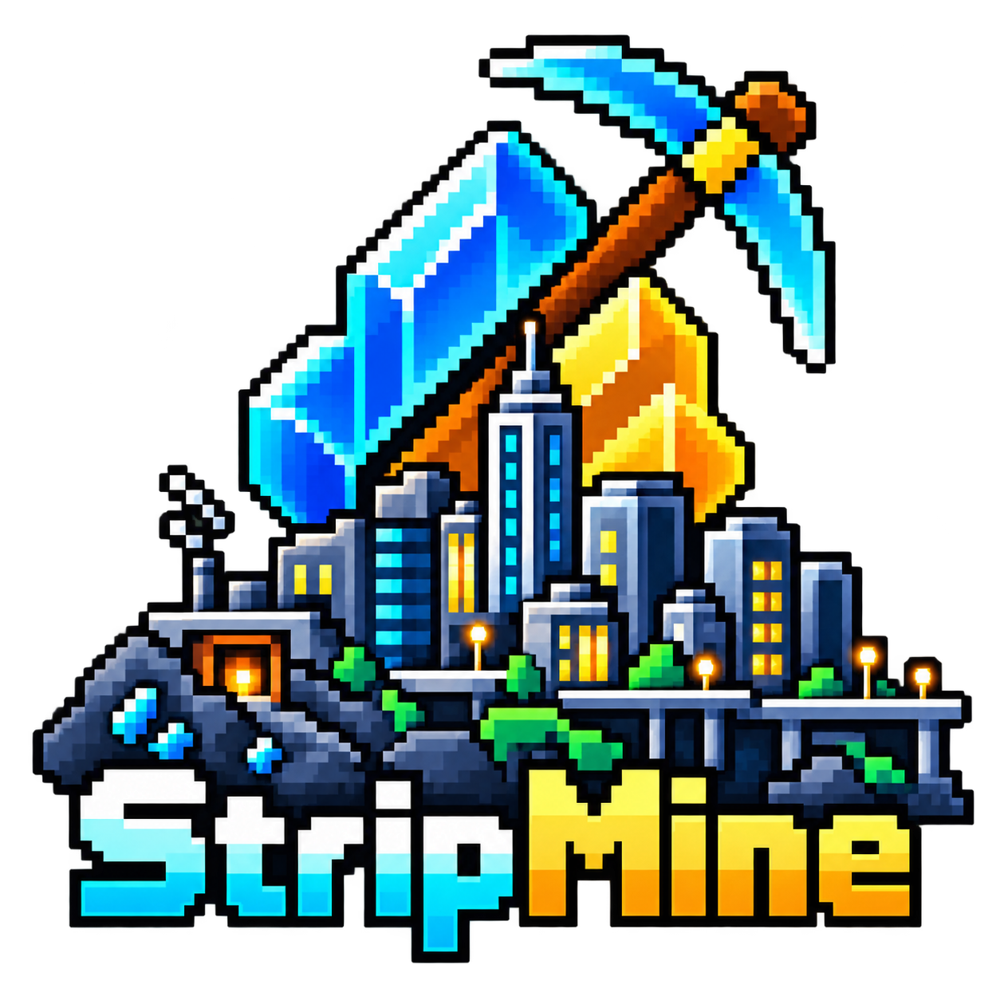

<p align="center"></p>

# StripMine concept site

The interactive presentation for [StripMine](https://github.com/Albusquerque/StripMine), a Decky idle game played across a television, the Decky control room, and the Steam Machine's 17-LED light bar.

**Live site:** https://albusquerque.github.io/stripmine-concept-site/

## Three synchronized views

- **Full game** runs the real compiled v0.1.1 television interface.
- **Decky tab** runs the same save as a compact control room with five rotating Dot Matrix cards.
- **Light bar** explains the 17 logical LEDs and simulates their continuous physical diffusion.

The Luminous and Contrasted profiles stay synchronized across every view.

## Local review

```bash
python3 -m http.server 8772
```

Then open `http://127.0.0.1:8772/`.

## Refresh from the Decky project

```bash
python3 scripts/sync_plugin.py
```

This copies the current `../StripMine/dist/index.js`, preview harness, and logo into the self-contained demo.

## Capture README media

With the local server running:

```bash
npm install
npm run capture:readme
```

The script records the real interactive views and writes optimized GIFs to `assets/readme-gifs/`.

## License

BSD 3-Clause.
